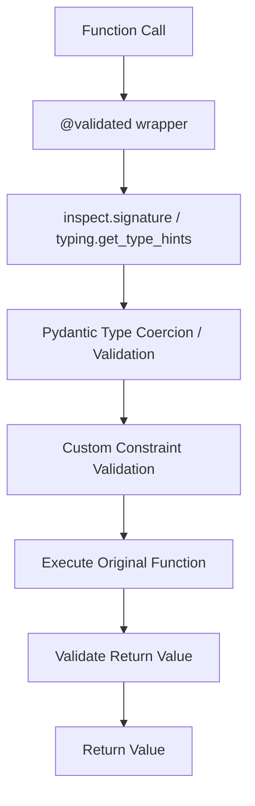

# Constraints & Satellite Validation Engine

This repository contains:
1. **`validated`**: A lightweight data validation and type coercion library using Pydantic and NumPy under the hood.
2. **`satellite`**: A realistic simulation domain package (located under `src/satellite`) demonstrating how to enforce operational constraints on complex satellite subsystems.

---

## 1. How the `validated` Package Works

The `validated` library leverages Python's PEP 593 (`typing.Annotated`) metadata to attach validation rules directly to function arguments. 

### File-by-File Implementation



#### A. [src/validated/exceptions.py](src/validated/exceptions.py)
This module defines the custom `ValidationError` exception.
* **Implementation**: Subclasses the standard `ValueError` and stores contextual information: `parameter_name`, `value` (that caused the violation), `constraint` (the constraint object violated), and the `message`.
* **Design Decision**: Explicitly tracking the failing parameter name and the rejected value allows upstream systems (like telemetry managers or REST APIs) to render targeted error messages, log failures, or trigger automatic safing procedures without guessing which argument failed.

#### B. [src/validated/models.py](src/validated/models.py)
This file defines the class hierarchy of all validation rule classes.
* **`Validator` Base Class**:
  Defines the abstract interface: `validate(self, value) -> bool` and `error_message(self, value) -> str`.
* **Standard Constraints**:
  - `GreaterThan` & `LessThan`: Basic boundary checks.
  - `InRange`: Keeps numerical values inside a closed interval `[min_val, max_val]`.
  - `Length`: Asserts string or list length criteria.
  - `MatchesPattern`: Enforces regex constraints on strings.
  - `Check`: Accepts a custom predicate callable (like a lambda or function) and description, offering arbitrary custom checks.
* **NumPy-specific Constraints**:
  - `Shape`: Inspects a NumPy array's `.shape` attribute and matches it to a predefined tuple template (supporting wildcard constraints using `-1`, `*`, or `None`).
  - `DType`: Validates the NumPy array's data type.
* **Design Decision**: *Why class-based instead of pure functions?*
  Using objects allows constraints to be parameterizable (e.g., storing boundaries inside `min_val` and `max_val`). When a validation fails, the constraint instance is returned along with the exception, allowing the caller to inspect metadata or build context-aware logs (e.g. `isinstance(e.validator, Shape)`).

#### C. [src/validated/decorator.py](src/validated/decorator.py)
This is the core validation engine that implements the `@validated` decorator.
* **Implementation Details**:
  1. **Signature Parsing**: Uses `inspect.signature(func)` to determine names and order of arguments.
  2. **Type Extraction**: Uses `typing.get_type_hints(func, include_extras=True)` to retrieve the type signatures. Passing `include_extras=True` ensures that metadata inside `Annotated[Type, Metadata]` is preserved.
  3. **Value Coercion**: For each argument, the decorator runs the value through Pydantic's `TypeAdapter(base_type).validate_python(val)`. This ensures that inputs (e.g. string `"5"`) are automatically coerced to their proper types (e.g. integer `5`).
  4. **Constraint Enforcement**: Iterates over any metadata constraints extracted from `Annotated` parameters and calls `.validate()` on them.
  5. **Variadic Support**: Special logic safely unpacks and validates positional arguments (`*args` / `VAR_POSITIONAL`) and keyword arguments (`**kwargs` / `VAR_KEYWORD`).
  6. **Return Value Checks**: Finally, it repeats this process on the return value of the function before sending it back.
* **Design Decision**: *Why Pydantic TypeAdapter?*
  Instead of writing manual type checkers for floats, dicts, lists, and model definitions, Pydantic's underlying Rust validation engine handles extremely fast type coercion and validation. By separating coercion (type safety) from custom constraints (value safety), the code remains incredibly clean.

### Selective Validation Levels

The `@validated` decorator supports three levels of validation on a parameter-by-parameter basis:

1. **Full Validation (Type Coercion + Value Constraints)**:
   Using `Annotated[Type, Constraint]`. The parameter is type-checked (and coerced if possible), then all associated constraints are validated.
   ```python
   # E.g. subsystem_id: Annotated[str, MatchesPattern(r"^(ACS|PWR|COM)-\d{3}$")]
   ```
2. **Type Validation Only (No Value Constraints)**:
   Using a plain type hint (e.g., `float`). The parameter is type-checked and coerced, but no custom constraints are run.
   ```python
   # E.g. temperature_offset: float
   ```
3. **No Validation (Bypassed)**:
   Using `Any` (or omitting annotations). The parameter is completely ignored by the decorator.
   ```python
   # E.g. raw_telemetry: Any
   ```

This is demonstrated in [src/satellite/validation.py](src/satellite/validation.py) via `validate_subsystem_diagnostics`.

---

## 2. The `satellite` Package & Subsystem Validation

Real-world systems, such as satellites, consist of numerous interconnected discrete and continuous states. Depending on the current operational mode of the satellite, different validation rules must hold true to prevent catastrophic failures.

The `satellite` package, located under `src/satellite`, models this telemetry stream.

### Subsystem Models ([src/satellite/models.py](src/satellite/models.py))
We use Pydantic models to represent the telemetry state:
* **`BatteryState`**: Continuous values like `charge_level`, `temperature`, `current_draw`, and discrete status (`"charging"`, `"discharging"`).
* **`SolarPanelState`**: `deployed` status and continuous `power_generated` values.
* **`ACSState` (Attitude Control System)**: Tracks orientation (`pointing_deviation` from target) and reaction wheels.
  - Crucially, reaction wheel speeds are represented as a 3D vector NumPy array (`shape=(3,)`), which must consist of double-precision floats.
* **`CommsState`**: Links visibility to the ground station.
* **`SatelliteTelemetry`**: A wrapper representing the aggregate state of the spacecraft along with its current `mode`.

### Subsystem Telemetry Validation ([src/satellite/validation.py](src/satellite/validation.py))
Instead of nesting complex `if/else` checks inside a single massive function, we divide and conquer using the `@validated` decorator:

#### A. Checking NumPy Arrays
The Attitude Control System controls orientation using 3 reaction wheels. If the telemetry lists only 2 wheels or uses the wrong encoding, it's a structural failure. We enforce this cleanly using annotations:
```python
@validated
def check_reaction_wheels(
    wheel_speeds: Annotated[np.ndarray, Shape(3), DType(np.float64)]
) -> bool:
    return True
```

#### B. Charging Mode Rules
In `charging` mode, we assert that:
1. Solar panels are fully deployed.
2. The panels are facing the sun (deviation < 5.0 degrees).
3. The battery status is set to `"charging"`.
4. The battery charge level is in a safe region (`[50.0, 100.0]`).
5. Net power is positive (total generated - total drawn > 0).

```python
@validated
def validate_charging_telemetry(
    panels_deployed: Annotated[bool, Check(lambda x: x is True, "all solar panels must be deployed")],
    net_power: Annotated[float, GreaterThan(0.0)],
    battery_status: Annotated[str, Check(lambda s: s == "charging", "battery status must be 'charging'")],
    battery_charge_level: Annotated[float, InRange(50.0, 100.0)],
    sun_pointing_deviation: Annotated[float, LessThan(5.0)],
    reaction_wheel_speeds: Annotated[np.ndarray, Shape(3), DType(np.float64)],
) -> bool:
    return True
```

#### C. Data Collection Mode Rules
During science observations, requirements change:
1. Ground station contact must be active to stream scientific data.
2. The pointing deviation must be extremely precise (deviation < 1.0 degree).
3. The thermal subsystem must keep the batteries between `-10` and `40` degrees Celsius.
4. Current draw cannot exceed the safe battery limit (verified using a `power_margin > 0` constraint).

#### D. Pre-Commit Task Safety Checking
Before committing a planned spacecraft task (e.g., targeting a Point of Interest), we run pre-commit validations to prevent execution of rules that violate satellite thresholds (such as excessive slew speeds which could desaturate reaction wheels, or insufficient coverage):

```python
# From src/satellite/validation.py
@validated
def validate_slew_task(
    poi_name: Annotated[str, Length(min_len=1)],
    max_slew_speed: Annotated[float, LessThan(2.0)],             # Slew speed limit: 2.0 deg/s
    predicted_coverage: Annotated[float, InRange(80.0, 100.0)],  # Min coverage requirement: 80%
) -> bool:
    return True
```

Tasks are modeled via `SlewTask` and `ImagingTask` and routed through `validate_task()`.

---

## 3. Database Configuration & Before-Import Initialization

In production spacecraft ground stations, constraint thresholds (e.g., maximum slew speeds, cloud cover limits, minimum battery states) are stored in databases. This allows operators to adjust safety guidelines on a per-satellite or per-task basis without redeploying code.

The database architecture for this project uses a **Single Polymorphic Table (Document Style)** — all constraint types share one table with a JSONB `parameters` column. This design supports:

* **Before-Import Initialization**: Loading constraint values from the database at startup, then binding them into the `@validated` decorator annotations before `validation.py` is imported.
* **Per-Satellite Rules**: Different thresholds for different spacecraft (e.g., an older satellite with degraded reaction wheels might use `LessThan(1.0)` for slew speed, while a newer one uses `LessThan(3.0)`).
* **Safe Predicate Serialization**: `Check` predicates are stored as registry keys (not raw code) and resolved to hardcoded lambdas at startup via a Named Predicate Registry.
* **Runtime Hot-Reloading (Docker)**: A Proxy Constraint pattern enables live threshold updates without container restarts.

> **Note**: The database schema, rules module, closure-based compilation, predicate factories, and the Proxy Constraint pattern are documented in detail in [DATABASE_DESIGN.md](DATABASE_DESIGN.md). The code examples in that document are a **design reference** for integrating the library with a real database — they are not shipped as part of this package.

---

## 4. How to Run & Verify the Code

Make sure your virtual environment is active:
```powershell
.venv\Scripts\Activate.ps1
```

### Running the Tests
To run all tests (including the core library tests and the satellite examples tests):
```bash
pytest tests
```

### Running the Telemetry Simulation Demo
Run the telemetry validation demo script from the root workspace:
```bash
python run_satellite_demo.py
```
This script runs a sequence of telemetry packages simulating normal operations, bad sensor dimensions, battery overheating, and pointing errors, showcasing how constraints elegantly isolate and catch exceptions.

