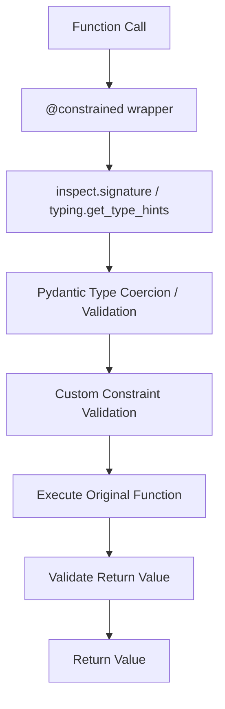

# Constraints & Satellite Validation Engine

This repository contains:
1. **`constraints`**: A lightweight data validation and type coercion library using Pydantic and NumPy under the hood.
2. **`satellite`**: A realistic simulation domain package (located under `src/satellite`) demonstrating how to enforce operational constraints on complex satellite subsystems.

---

## 1. How the `constraints` Package Works

The `constraints` library leverages Python's PEP 593 (`typing.Annotated`) metadata to attach validation rules directly to function arguments. 

### File-by-File Implementation



#### A. [src/constraints/exceptions.py](src/constraints/exceptions.py)
This module defines the custom `ConstraintValidationError` exception.
* **Implementation**: Subclasses the standard `ValueError` and stores contextual information: `parameter_name`, `value` (that caused the violation), `constraint` (the constraint object violated), and the `message`.
* **Design Decision**: Explicitly tracking the failing parameter name and the rejected value allows upstream systems (like telemetry managers or REST APIs) to render targeted error messages, log failures, or trigger automatic safing procedures without guessing which argument failed.

#### B. [src/constraints/models.py](src/constraints/models.py)
This file defines the class hierarchy of all validation rule classes.
* **`Constraint` Base Class**:
  Defines the abstract interface: `validate(self, value) -> bool` and `error_message(self, value) -> str`.
* **Standard Constraints**:
  - `GreaterThan` & `LessThan`: Basic boundary checks.
  - `InRange`: Keeps numerical values inside a closed interval `[min_val, max_val]`.
  - `Length`: Asserts string or list length criteria.
  - `MatchesPattern`: Enforces regex constraints on strings.
  - `Check`: Accepts a custom predicate callable (like a lambda or function) and description, offering arbitrary custom checks.
* **NumPy-specific Constraints**:
  - `Shape`: Inspects a NumPy array's `.shape` attribute and matches it to a predefined tuple template (supporting wildcard constraints using `-1`, `*`, or `None`).
  - `DType`: Validates the NumPy array's data type.
* **Design Decision**: *Why class-based instead of pure functions?*
  Using objects allows constraints to be parameterizable (e.g., storing boundaries inside `min_val` and `max_val`). When a validation fails, the constraint instance is returned along with the exception, allowing the caller to inspect metadata or build context-aware logs (e.g. `isinstance(e.constraint, Shape)`).

#### C. [src/constraints/decorator.py](src/constraints/decorator.py)
This is the core validation engine that implements the `@constrained` decorator.
* **Implementation Details**:
  1. **Signature Parsing**: Uses `inspect.signature(func)` to determine names and order of arguments.
  2. **Type Extraction**: Uses `typing.get_type_hints(func, include_extras=True)` to retrieve the type signatures. Passing `include_extras=True` ensures that metadata inside `Annotated[Type, Metadata]` is preserved.
  3. **Value Coercion**: For each argument, the decorator runs the value through Pydantic's `TypeAdapter(base_type).validate_python(val)`. This ensures that inputs (e.g. string `"5"`) are automatically coerced to their proper types (e.g. integer `5`).
  4. **Constraint Enforcement**: Iterates over any metadata constraints extracted from `Annotated` parameters and calls `.validate()` on them.
  5. **Variadic Support**: Special logic safely unpacks and validates positional arguments (`*args` / `VAR_POSITIONAL`) and keyword arguments (`**kwargs` / `VAR_KEYWORD`).
  6. **Return Value Checks**: Finally, it repeats this process on the return value of the function before sending it back.
* **Design Decision**: *Why Pydantic TypeAdapter?*
  Instead of writing manual type checkers for floats, dicts, lists, and model definitions, Pydantic's underlying Rust validation engine handles extremely fast type coercion and validation. By separating coercion (type safety) from custom constraints (value safety), the code remains incredibly clean.

### Selective Validation Levels

The `@constrained` decorator supports three levels of validation on a parameter-by-parameter basis:

1. **Full Validation (Type Coercion + Value Constraints)**:
   Using `Annotated[Type, Constraint]`. The parameter is type-checked (and coerced if possible), then all associated constraints are validated.
   ```python
   # E.g. subsystem_id: Annotated[str, MatchesPattern(r"^(ACS|PWR|COM)-\d{3}$")]
   ```
2. **Type Validation Only (No Value Constraints)**:
   Using a plain type hint (e.g., `float`). The parameter is type-checked and coerced, but no custom constraints are run.
   ```python
   # E.g. temperature_offset: float
   ```
3. **No Validation (Bypassed)**:
   Using `Any` (or omitting annotations). The parameter is completely ignored by the decorator.
   ```python
   # E.g. raw_telemetry: Any
   ```

This is demonstrated in [src/satellite/validation.py](src/satellite/validation.py) via `validate_subsystem_diagnostics`.

---

## 2. The `satellite` Package & Subsystem Validation

Real-world systems, such as satellites, consist of numerous interconnected discrete and continuous states. Depending on the current operational mode of the satellite, different validation rules must hold true to prevent catastrophic failures.

The `satellite` package, located under `src/satellite`, models this telemetry stream.

### Subsystem Models ([src/satellite/models.py](src/satellite/models.py))
We use Pydantic models to represent the telemetry state:
* **`BatteryState`**: Continuous values like `charge_level`, `temperature`, `current_draw`, and discrete status (`"charging"`, `"discharging"`).
* **`SolarPanelState`**: `deployed` status and continuous `power_generated` values.
* **`ACSState` (Attitude Control System)**: Tracks orientation (`pointing_deviation` from target) and reaction wheels.
  - Crucially, reaction wheel speeds are represented as a 3D vector NumPy array (`shape=(3,)`), which must consist of double-precision floats.
* **`CommsState`**: Links visibility to the ground station.
* **`SatelliteTelemetry`**: A wrapper representing the aggregate state of the spacecraft along with its current `mode`.

### Subsystem Telemetry Validation ([src/satellite/validation.py](src/satellite/validation.py))
Instead of nesting complex `if/else` checks inside a single massive function, we divide and conquer using the `@constrained` decorator:

#### A. Checking NumPy Arrays
The Attitude Control System controls orientation using 3 reaction wheels. If the telemetry lists only 2 wheels or uses the wrong encoding, it's a structural failure. We enforce this cleanly using annotations:
```python
@constrained
def check_reaction_wheels(
    wheel_speeds: Annotated[np.ndarray, Shape(3), DType(np.float64)]
) -> bool:
    return True
```

#### B. Charging Mode Rules
In `charging` mode, we assert that:
1. Solar panels are fully deployed.
2. The panels are facing the sun (deviation < 5.0 degrees).
3. The battery status is set to `"charging"`.
4. The battery charge level is in a safe region (`[50.0, 100.0]`).
5. Net power is positive (total generated - total drawn > 0).

```python
@constrained
def validate_charging_telemetry(
    panels_deployed: Annotated[bool, Check(lambda x: x is True, "all solar panels must be deployed")],
    net_power: Annotated[float, GreaterThan(0.0)],
    battery_status: Annotated[str, Check(lambda s: s == "charging", "battery status must be 'charging'")],
    battery_charge_level: Annotated[float, InRange(50.0, 100.0)],
    sun_pointing_deviation: Annotated[float, LessThan(5.0)],
    reaction_wheel_speeds: Annotated[np.ndarray, Shape(3), DType(np.float64)],
) -> bool:
    return True
```

#### C. Data Collection Mode Rules
During science observations, requirements change:
1. Ground station contact must be active to stream scientific data.
2. The pointing deviation must be extremely precise (deviation < 1.0 degree).
3. The thermal subsystem must keep the batteries between `-10` and `40` degrees Celsius.
4. Current draw cannot exceed the safe battery limit (verified using a `power_margin > 0` constraint).

#### D. Pre-Commit Task Safety Checking
Before committing a planned spacecraft task (e.g., targeting a Point of Interest), we run pre-commit validations to prevent execution of rules that violate satellite thresholds (such as excessive slew speeds which could desaturate reaction wheels, or insufficient coverage):

```python
# From src/satellite/validation.py
@constrained
def validate_slew_task(
    poi_name: Annotated[str, Length(min_len=1)],
    max_slew_speed: Annotated[float, LessThan(2.0)],             # Slew speed limit: 2.0 deg/s
    predicted_coverage: Annotated[float, InRange(80.0, 100.0)],  # Min coverage requirement: 80%
) -> bool:
    return True
```

Tasks are modeled via `SlewTask` and `ImagingTask` and routed through `validate_task()`.

---

## 3. Database Configuration & Before-Import Initialization

In production spacecraft ground stations and operational centers, constraint thresholds (e.g., maximum slew speeds, cloud cover limits, minimum battery states) are stored in databases. This allows operators to adjust safety guidelines on a per-satellite or per-task basis without redeploying code.

By combining a relational schema with **Before-Import Initialization**, we can load constraint values from a database at startup *before* importing the validation module. This allows you to retain the clean, declarative `@constrained` decorator syntax while fully representing each constraint dynamically in your database.

### A. Database Schema
In this database schema, we represent constraints using UUIDs and link each rule to a specific satellite (via its official `satellite_norad_id`) and a specific task definition (via `task_id`):

```sql
CREATE TABLE satellites (
    norad_id INT PRIMARY KEY,              -- official NORAD catalog ID
    name VARCHAR(100) NOT NULL
);

CREATE TABLE task_definitions (
    id UUID PRIMARY KEY DEFAULT gen_random_uuid(),
    name VARCHAR(100) NOT NULL             -- e.g., "slew_to_poi" or "science_imaging"
);

CREATE TABLE operational_constraints (
    id UUID PRIMARY KEY DEFAULT gen_random_uuid(),
    satellite_norad_id INT NOT NULL REFERENCES satellites(norad_id) ON DELETE CASCADE,
    task_id UUID NOT NULL REFERENCES task_definitions(id) ON DELETE CASCADE,
    context_name VARCHAR(100) NOT NULL,    -- e.g., "slew_task"
    parameter_name VARCHAR(100) NOT NULL,  -- e.g., "max_slew_speed"
    constraint_type VARCHAR(50) NOT NULL,  -- e.g., "LessThan", "InRange"
    parameters JSONB NOT NULL              -- e.g., '{"threshold": 2.0}' or '{"min_val": 80, "max_val": 100}'
);
```

### B. Shared Rules Module (`rules.py`)
At startup, query all active constraints for your target satellite and task, instantiate them into Python `Constraint` objects, and store them in an in-memory cache registry:

```python
# src/satellite/rules.py
from constraints import GreaterThan, LessThan, InRange, Length, MatchesPattern, Constraint

CONSTRAINT_REGISTRY = {
    "GreaterThan": GreaterThan,
    "LessThan": LessThan,
    "InRange": InRange,
    "Length": Length,
    "MatchesPattern": MatchesPattern,
}

# In-memory dictionary cache of loaded constraints
# Structure: { context_name: { parameter_name: constraint_object } }
ACTIVE_CONSTRAINTS: dict[str, dict[str, Constraint]] = {}

def load_constraint(constraint_type: str, parameters: dict) -> Constraint:
    cls = CONSTRAINT_REGISTRY.get(constraint_type)
    if not cls:
        raise ValueError(f"Unknown constraint: {constraint_type}")
    return cls(**parameters)

def load_from_database(db_connection, norad_id: int, target_task_id: str):
    """Fetches constraints from the DB matching this satellite and task, and caches them."""
    global ACTIVE_CONSTRAINTS
    cursor = db_connection.cursor()
    cursor.execute(
        """
        SELECT context_name, parameter_name, constraint_type, parameters 
        FROM operational_constraints 
        WHERE satellite_norad_id = ? AND task_id = ?
        """,
        (norad_id, target_task_id)
    )
    
    temp_cache = {}
    for context, param, c_type, params in cursor.fetchall():
        constraint_obj = load_constraint(c_type, params)
        if context not in temp_cache:
            temp_cache[context] = {}
        temp_cache[context][param] = constraint_obj
        
    ACTIVE_CONSTRAINTS = temp_cache

def get_rule(context: str, parameter: str) -> Constraint:
    """Helper used in type annotations to fetch the preloaded constraint at import-time."""
    return ACTIVE_CONSTRAINTS.get(context, {}).get(parameter)
```

### C. Declaring Validations (`validation.py`)
Import the `rules` module and reference `rules.get_rule(...)` directly inside your `Annotated` type hints. When the module is imported, `@constrained` parses the signature and captures the preloaded constraints:

```python
# src/satellite/validation.py
from typing import Annotated
from constraints import constrained
import satellite.rules as rules

@constrained
def validate_slew_task(
    poi_name: str,
    # Dynamically references the object loaded from the database during boot
    max_slew_speed: Annotated[float, rules.get_rule("slew_task", "max_slew_speed")],
    predicted_coverage: Annotated[float, rules.get_rule("slew_task", "predicted_coverage")],
) -> bool:
    return True
```

### D. Application Startup & Execution (`main.py`)
Run the initialization query matching your spacecraft and task *before* importing your validation functions:

```python
# main.py
import sqlite3
import uuid
import satellite.rules as rules

# 1. Choose target satellite (NORAD ID) and task (UUID)
SAT_NORAD_ID = 25544  # ISS NORAD catalog ID
SLEW_TASK_UUID = "e4a2d8d8-795a-4e2b-a01c-d762e84d4b1a"

# 2. Connect to the DB and load constraints into memory
conn = sqlite3.connect("spacecraft.db")
rules.load_from_database(conn, SAT_NORAD_ID, SLEW_TASK_UUID)

# 3. NOW import your validations (they will compile using the cached database configurations)
from satellite.validation import validate_slew_task

# 4. Safely validate incoming payloads against DB-configured limits
# This runs fully in-memory at nanosecond speeds!
validate_slew_task("Sydney_POI", max_slew_speed=1.1, predicted_coverage=89.0)
```

### E. Why use this combined approach?
1. **Fully DB-Driven**: Every constraint is represented as a structured row in the database, enabling audit logging, operator overrides, and hot adjustments.
2. **Pre-Filter by Spacecraft & Task**: You can maintain different thresholds for different satellites (e.g. an older satellite with degraded wheels might have a `LessThan(1.0)` slew limit, whereas a newer satellite has a `LessThan(3.0)` limit).
3. **Declarative Decorator Syntax**: Functions maintain clean annotations and fail loudly with explicit validation errors if a task payload violates thresholds.
4. **Optimal Performance**: Bypasses all runtime database queries. Once imported, checks run strictly in-memory.

---

## 4. How to Run & Verify the Code

Make sure your virtual environment is active:
```powershell
.venv\Scripts\Activate.ps1
```

### Running the Tests
To run all tests (including the core library tests and the satellite examples tests):
```bash
pytest tests
```

### Running the Telemetry Simulation Demo
Run the telemetry validation demo script from the root workspace:
```bash
python run_satellite_demo.py
```
This script runs a sequence of telemetry packages simulating normal operations, bad sensor dimensions, battery overheating, and pointing errors, showcasing how constraints elegantly isolate and catch exceptions.

